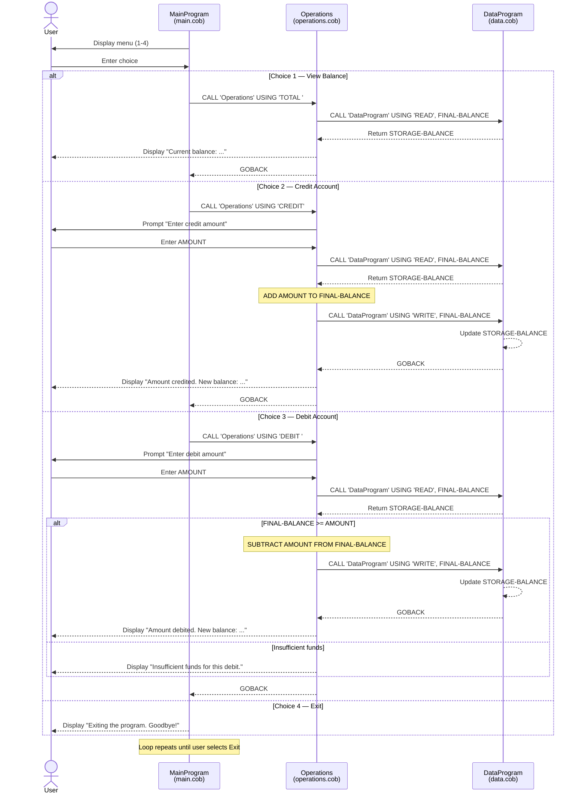

# Student Account Management System — COBOL Documentation

## Overview

This COBOL application implements a **Student Account Management System** that allows users to view balances, credit funds, and debit funds from a student account. The system follows a modular architecture split across three source files, each with a distinct responsibility.

---

## File Descriptions

### `main.cob` — Entry Point & Menu Interface

**Program ID:** `MainProgram`

Serves as the application entry point. Presents a text-based menu to the user and dispatches operations to the `Operations` module.

**Key behavior:**

- Displays a menu loop with four options: View Balance, Credit Account, Debit Account, and Exit.
- Accepts user input (1–4) and delegates to `Operations` via `CALL 'Operations'` with the corresponding operation code.
- Repeats until the user selects Exit (option 4), which sets `CONTINUE-FLAG` to `'NO'`.
- Invalid input (outside 1–4) displays an error message and re-prompts.

**Operation codes passed to `Operations`:**

| Menu Choice | Operation Code |
|-------------|---------------|
| 1 — View Balance | `'TOTAL '` |
| 2 — Credit Account | `'CREDIT'` |
| 3 — Debit Account | `'DEBIT '` |
| 4 — Exit | *(handled locally)* |

---

### `operations.cob` — Business Logic

**Program ID:** `Operations`

Contains the core business logic for all account operations. Receives an operation code from `MainProgram` and interacts with `DataProgram` for data persistence.

**Key functions:**

- **TOTAL (View Balance):** Reads the current balance from `DataProgram` and displays it to the user.
- **CREDIT:** Prompts the user for an amount, reads the current balance, adds the amount, writes the updated balance back, and displays the new balance.
- **DEBIT:** Prompts the user for an amount, reads the current balance, and:
  - If sufficient funds exist (`FINAL-BALANCE >= AMOUNT`): subtracts the amount, writes the updated balance, and displays the new balance.
  - If insufficient funds: displays `"Insufficient funds for this debit."` and does **not** modify the balance.

**Business rules:**

1. **Insufficient funds protection** — A debit operation is rejected if the requested amount exceeds the current balance. The account balance is never allowed to go negative.
2. **Balance precision** — All monetary values use the format `PIC 9(6)V99`, supporting amounts up to 999,999.99 with two decimal places.
3. **Initial balance** — The working-storage `FINAL-BALANCE` is initialized to `1000.00`.

---

### `data.cob` — Data Storage Layer

**Program ID:** `DataProgram`

Acts as a simple in-memory data store for the account balance. Provides read/write access through a passed operation code.

**Key functions:**

- **READ:** Copies the stored balance (`STORAGE-BALANCE`) into the caller's `BALANCE` parameter.
- **WRITE:** Updates the stored balance from the caller's `BALANCE` parameter.

**Data characteristics:**

- `STORAGE-BALANCE` is initialized to `1000.00` at program load.
- Balance is held in working storage (in-memory); it is **not** persisted to disk and resets when the program restarts.

---

## Architecture

```
MainProgram (main.cob)
    │
    ├── CALL 'Operations' ──► Operations (operations.cob)
    │                              │
    │                              ├── CALL 'DataProgram' READ  ──► DataProgram (data.cob)
    │                              └── CALL 'DataProgram' WRITE ──► DataProgram (data.cob)
    │
    └── Menu loop / user input
```

## Business Rules Summary

| Rule | Description |
|------|-------------|
| **No negative balances** | Debit operations are blocked when the amount exceeds the current balance. |
| **Initial balance** | Every new session starts with a default balance of **1,000.00**. |
| **In-memory storage** | Balance data is not persisted to disk; it resets on each program run. |
| **Max balance value** | The `PIC 9(6)V99` format caps the balance at **999,999.99**. |
| **Decimal precision** | All amounts are stored with exactly **2 decimal places**. |

---

## Sequence Diagram — Data Flow


